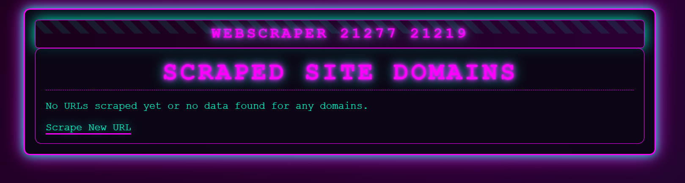

# Projekt Web Scraper

## Opis
Rozproszona aplikacja do scrapowania stron internetowych, która wyciąga e-maile, adresy i inne dane, zapisując je w MongoDB. Stworzona z użyciem Flask, wielowątkowości i asyncio.

## Struktura

*   `engine/`
    *   `engine.py`
*   `frontend/`
    *   `app.py`  
    *   `scraper.py` 
    *   `static/`
        *   `style.css`
    *   `templates/`
        *   `base.html`
        *   `scraper/`
            *   `index.html`
            *   `results_emails.html`
            *   `results_postal_codes.html`
            *   `results_social_media.html`
            *   `results.html`
            *   `scrape.html`
*   `docker-compose.yaml`
*   `Dockerfile`
*   `main.py`
*   `queue.txt`
*   `requirements.txt`

## Wymagania
- Docker i Docker Compose
- Python 3.8+ (opcjonalne, do lokalnego uruchomienia)

## Skalowalność
- Wykorzystuje wielowątkowość dla skalowania na CPU.
- Możliwość rozszerzenia na klastry z Docker Swarm.

## Autorzy
- Sebastian Miler, Mateusz Brodzik

## Złożenie
- Demonstracja: Czerwiec 2025
